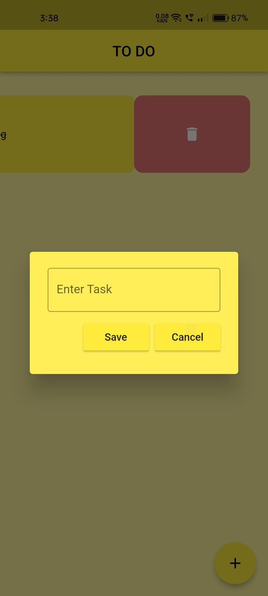
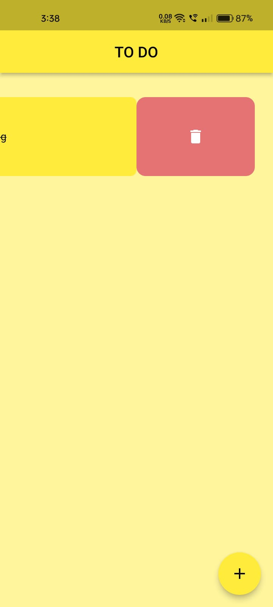
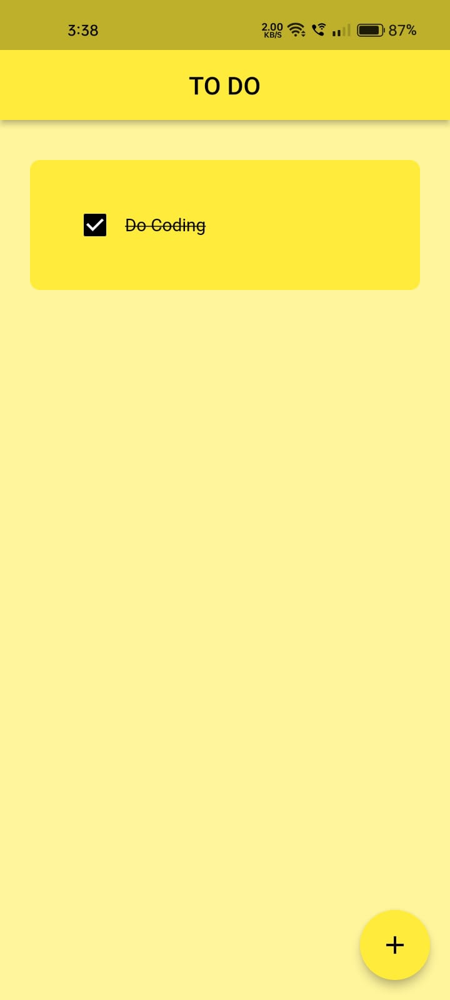
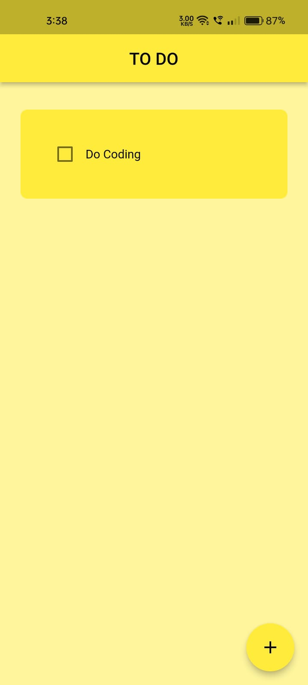

# HACKTOBER FEST 2023 WEB DEV

This is a solution to the ToDo application given in the HACKTOBERFEST 2023

## Table of contents

  - [Overview](#overview)
  - [Screenshot](#screenshot)
  - [Links](#links)
  - [Description](#description)
  - [Built with](#built-with)
  - [What I learned](#what-i-learned)
  - [Author](#author)

## Overview

An ToDo App that uses Hive to store and read data. It is made using Flutter and with the use of Hive. 

### Screenshot

### Links

Link for ToDo Apk -
https://drive.google.com/file/d/1Ho0PFdo7BwUpqCnLxGFSW7KTGckUTYjl/view?usp=sharing

## Description

I started by making the UI of the app, which was a little bit challenging as i had just started flutter few weeks back and it was my first time ever using the Hive. So i had to take help from many different resources like StackOverFLow, Youtube.
But it was interesting to make an app that can store data locally in your phone. You can easily write down your tasks and and remove them after the task has been completed.

### Built with

- Flutter
- Use of Hive for Database

### What I learned

I learned a lot during the process of making ToDo app. I got to know about many new widgets and mainly learnt about the usage of Hive Database in my app. How to intergrate Hive, how to extract the data from the Hive and many more.

## Author

- LinkedIn - [Sahil Bansal] (https://www.linkedin.com/in/sahil-bansal-882b41272/)
- Twitter - [@Sahil121315](https://x.com/Sahil121315?t=91yHYBDE2vjBnehGdAjZ0Q&s=09)

