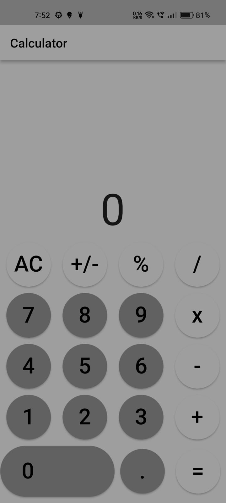

# HACKTOBER FEST 2023 WEB DEV

This is a solution to the ToDo application given in the HACKTOBERFEST 2023

## Table of contents

  - [Overview](#overview)
  - [Screenshot](#screenshot)
  - [Links](#links)
  - [Description](#description)
  - [Built with](#built-with)
  - [What I learned](#what-i-learned)
  - [Author](#author)

## Overview

An Calculator app made using Flutter is a mobile application that provides the functionality of a basic calculator. 

### Screenshot

### Links

Link for Calculator Apk -
https://drive.google.com/file/d/1HtEglRn-eMJzAAodqMW67PdBmQRI8JLj/view?usp=share_link

## Description

An Flutter-based calculator app which provides a user-friendly interface for performing basic arithmetic operations, offering input for numbers and common operators, accurate results, and optional features such as memory, history, and customization.

### Built with

- Flutter

### What I learned

While making of calculator app i learned a lot about the logic as it can perform different operations and there are many different numbers & operators. It was an interesting time to make this app.

## Author

- LinkedIn - [Sahil Bansal] (https://www.linkedin.com/in/sahil-bansal-882b41272/)
- Twitter - [@Sahil121315](https://x.com/Sahil121315?t=91yHYBDE2vjBnehGdAjZ0Q&s=09)

