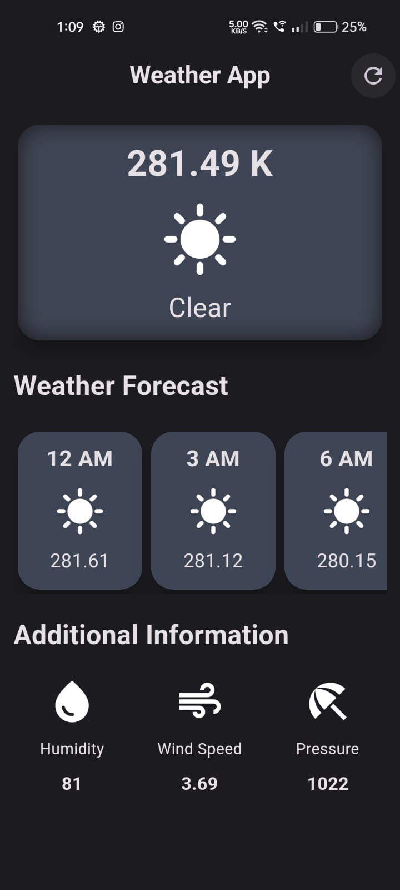
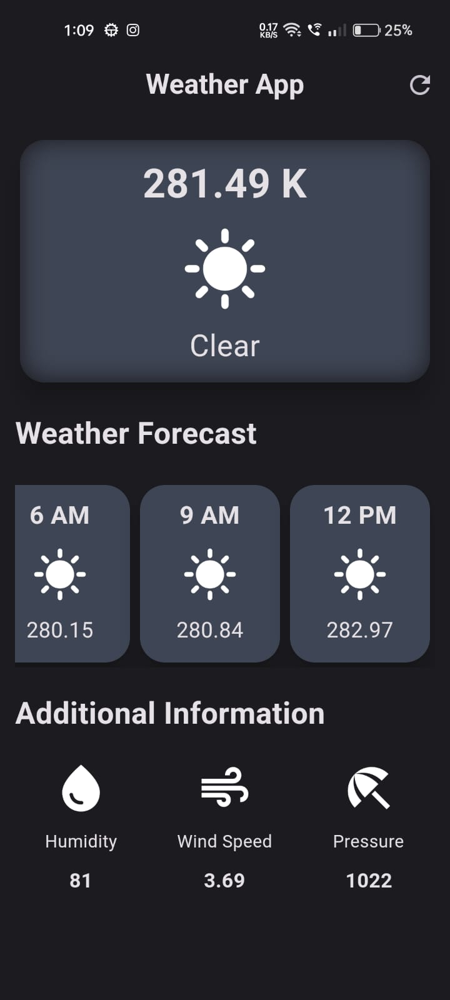

# HACKTOBER FEST 2023 WEB DEV

This is a solution to the weather application given in the HACKTOBERFEST 2023

## Table of contents

  - [Overview](#overview)
  - [Screenshot](#screenshot)
  - [Links](#links)
  - [Description](#description)
  - [Built with](#built-with)
  - [What I learned](#what-i-learned)
  - [Useful resources](#useful-resources)
  - [Author](#author)

## Overview

An weather App that uses API to get data and show weather and many additional information of London. It is made using Flutter and with the use of weather API. 

### Screenshot

### Links

Link for Weather Apk -
https://drive.google.com/file/d/1HBgQRP-Jd7dna5Q4EprHpAMvp-qRNcNa/view?usp=drive_link
 
## Description

I started by making the UI of the app, which was a little bit challenging as i had just started learning flutter few weeks back and it was my first time ever using the API. So i had to take help from many different resources like StackOverFLow, Youtube.
But it was interesting to make an make that showed realtime weather of London. It has weather forecast and additional information which contain Humidity, Wind Speed & Pressure.
It also has a refresh button if there is any issue.

### Built with

- Flutter
- Use of API for weather

### What I learned

I learned a lot during the process of making weather app. i got to know about many new widgets and mainly learnt about the usage of API's in my app. How to intergrate the API, how to extract the data from the API and many more.

### Useful resources

- Weather API (https://openweathermap.org/api) - This helped me for getting the weather data for free.

## Author

- LinkedIn - [Sahil Bansal] (https://www.linkedin.com/in/sahil-bansal-882b41272/)
- Twitter - [@Sahil121315](https://x.com/Sahil121315?t=91yHYBDE2vjBnehGdAjZ0Q&s=09)

